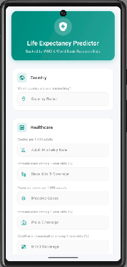
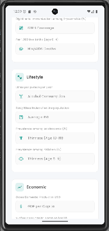
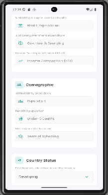
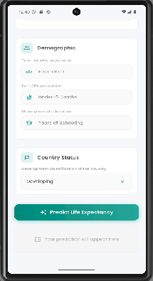

# Life Expectancy Prediction using Linear Regression

## Mission & Problem Description
This project predicts **Life Expectancy** of countries using socioeconomic and health indicators from the WHO.
Poor healthcare investment, diseases, and low income are key drivers of reduced life expectancy globally.
By modeling these relationships, the goal is to help policymakers identify which factors impact population health outcomes mostly.
Dataset source: [WHO Life Expectancy-Kaggle](https://www.kaggle.com/datasets/kumarajarshi/life-expectancy-who)[193 countries, in 2938 rows, 22 columns (2000–2015)].

---

## Project Structure

```
linear_regression_model/
├── summative/
│   ├── API/
│   │   ├── prediction.py             # FastAPI app (predict & retrain endpoints)
│   │   └── requirements.txt          # API dependencies
│   ├── FlutterApp/
│   │   └── life_expectancy_app/      # Flutter mobile app
│   │       ├── lib/
│   │       │   └── main.dart         # Single-screen app with form + result card
│   │       └── pubspec.yaml          # Flutter dependencies
│   └── linear_regression/
│       ├── multivariate.ipynb        # notebook
│       ├── Life Expectancy Data.csv  # the raw dataset
│       └── saved_models/
│           ├── best_model.pkl        # the saved best performing model
│           └── scaler.pkl            # StandardScaler used during training
└── README.md
```

---

## Models Used

| Model             | R² Score   | RMSE       |
|-------------------|------------|------------|
| Linear Regression | 0.8124     | 4.0313     |
| Decision Tree     | 0.9266     | 2.5219     |
| **Random Forest** | **0.9684** | **1.6548** |

**Best Model: Random Forest** — saved to `saved_models/best_model.pkl`

---

## API

### Public URL

**Deployed API:** https://linear-regression-model-d6zo.onrender.com

**Swagger UI Documentation:** https://linear-regression-model-d6zo.onrender.com/docs

### Endpoints

| Method | Path        | Description                                      |
|--------|-------------|--------------------------------------------------|
| GET    | `/`         | Health check                                     |
| GET    | `/features` | List the 18 features the model expects           |
| POST   | `/predict`  | Predict life expectancy from 18 input features   |
| POST   | `/retrain`  | Retrain the model by uploading a new CSV dataset |

### Input Features (Pydantic-validated)

All 18 features have explicit data types (`float` or `int`) and value constraints (`ge`/`le`) enforced via Pydantic:

`Adult_Mortality`, `Alcohol`, `Pct_Expenditure`, `Hepatitis_B`, `Measles`, `BMI`, `Under5_Deaths`, `Polio`, `Total_Exp`, `Diphtheria`, `HIV_AIDS`, `GDP`, `Population`, `Thinness_1_19`, `Thinness_5_9`, `Income_Composition`, `Schooling`, `Status_Developing`

### CORS Configuration

CORS middleware is configured with explicit (non-wildcard) values:

- **Allowed Origins:** `localhost`, `localhost:8080`, `10.0.2.2`, deployed Render URL
- **Allowed Methods:** `GET`, `POST`
- **Allowed Headers:** `Content-Type`, `Accept`
- **Credentials:** Enabled

### Retraining

Upload a CSV file (same format as the original WHO dataset) to `POST /retrain`. The endpoint preprocesses the data, retrains the Random Forest model, saves the updated model/scaler, and returns the new R² and RMSE scores.

---

## Flutter App

A mobile frontend for the prediction API, built with Flutter.

**Location:** `summative/FlutterApp/life_expectancy_app/`

### Features

- Categorized input form with 18 fields grouped into four sections: **Healthcare**, **Lifestyle**, **Economic**, and **Demographic**
- Country name input and Developing/Developed status selector
- Input validation with per-field range constraints
- Animated result card displaying the predicted life expectancy
- Loading state on the predict button and error messaging for network/validation failures

### Screenshots

| | | | |
|---|---|---|---|
|  |  |  |  |

### Key Dependencies

| Package | Purpose |
|---------|---------|
| `http ^1.2.0` | API calls to the FastAPI backend |
| `google_fonts ^8.0.2` | Poppins typography |
| `cupertino_icons ^1.0.8` | iOS-style icons |

### How to Run

1. Install [Flutter](https://flutter.dev/docs/get-started/install)
2. Navigate to the app directory:
   ```bash
   cd summative/FlutterApp/life_expectancy_app
   ```
3. Install dependencies:
   ```bash
   flutter pub get
   ```
4. Run on an emulator or connected device:
   ```bash
   flutter run
   ```

The app targets the deployed API at `https://linear-regression-model-d6zo.onrender.com` by default.

---

## How to Run

### Notebook
1. Clone the repository
2. Install dependencies:
   ```bash
   pip install pandas numpy scikit-learn matplotlib seaborn kaggle
   ```
3. Open `summative/linear_regression/multivariate.ipynb`
4. Run all cells

### API (locally)
1. Install API dependencies:
   ```bash
   pip install -r summative/API/requirements.txt
   ```
2. Start the server:
   ```bash
   uvicorn summative.API.prediction:app --reload
   ```
3. Open http://localhost:8000/docs for the Swagger UI
